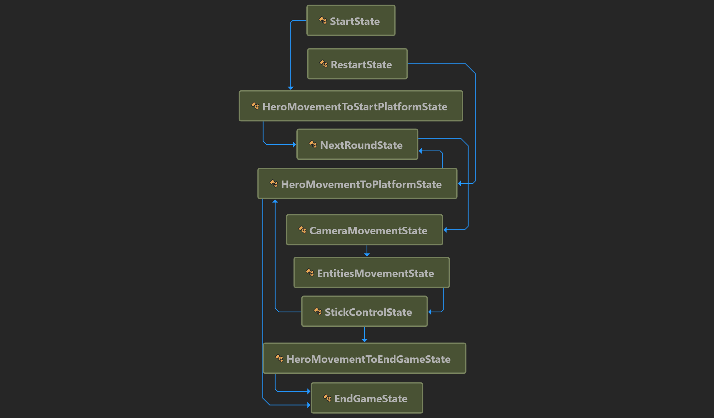
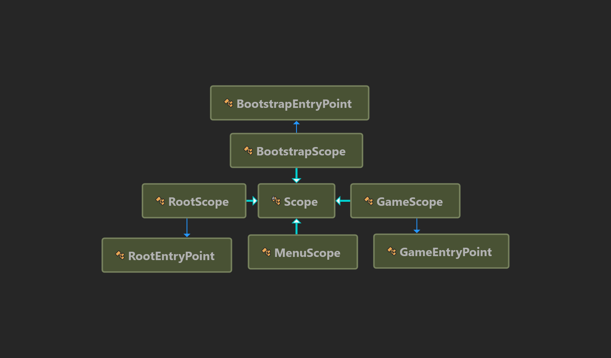

# An overengineering copy of the hyper-casual mobile game

Original game: [appstore](https://apps.apple.com/ru/app/stick-hero/id918338898), [youtube](https://youtu.be/T7_iuGL7uOA?t=19).

# Demo
https://user-images.githubusercontent.com/19392641/235690219-343009d0-68d0-41a0-9c4c-1ae9a1fb65a6.mp4 

https://user-images.githubusercontent.com/19392641/235690260-2f034975-bf54-4261-9f54-fbb9eff05a4d.mp4


### Features:
- Gameplay is based on the state machine pattern.
- Lazy loading and caching of all game objects.
- Full support for [Disabled Domain Reloading](https://docs.unity3d.com/Manual/DomainReloading.html) with correct loading of the game from any scene.
- UI is based on MVC(MVP) and is divided into canvases for loading/unloading the UI in parts.
- Player progress, ads, in-app purchases.
- Data are stored in the ScriptableObjects
- Extended DI-container for asynchronous preloading of assets in scopes (see below)
- Wrapper over Addressables for convenient work with DI-container (see below)

## Asynchronous preloading in the scopes:
```C#
public class MyScope : Scope
{
    private static readonly Address<Player> _player = new("PlayerKey");
    private Player _playerInstance;

    protected override async UniTask PreloadAsync(IAddressablesLoader loader)
    {
        // The scene will start loading when this method ends
        _playerInstance = await loader.LoadAssetAsync(_player);
    }
    
    protected override void ConfigureServices(IContainerBuilder builder)
    {
        builder.RegisterInstance(_playerInstance);
    }
}
```

## [AddressableAssets](https://github.com/YegorStepanov/ProjectAlpha/tree/main/ProjectAlpha/Assets/Code/AddressableAssets)
[AddressableAssets](https://github.com/YegorStepanov/ProjectAlpha/tree/main/ProjectAlpha/Assets/Code/AddressableAssets) is a wrapper for the Addressables package with factories, pools, caches, loaders for convenient work with the DI-container (VContainer).

# Diagram for game state machine:


# Diagram for scopes


## Warning
Works and tested in Unity 2020 LTS.
Does not work in the 2021+ versions because [CSharpCompilerSettingsForUnity](https://github.com/mob-sakai/CSharpCompilerSettingsForUnity)
package does not work with newer versions. The package bumps C# version to C# 10. The "record struct" and "with" keyword are heavily used in this project.
